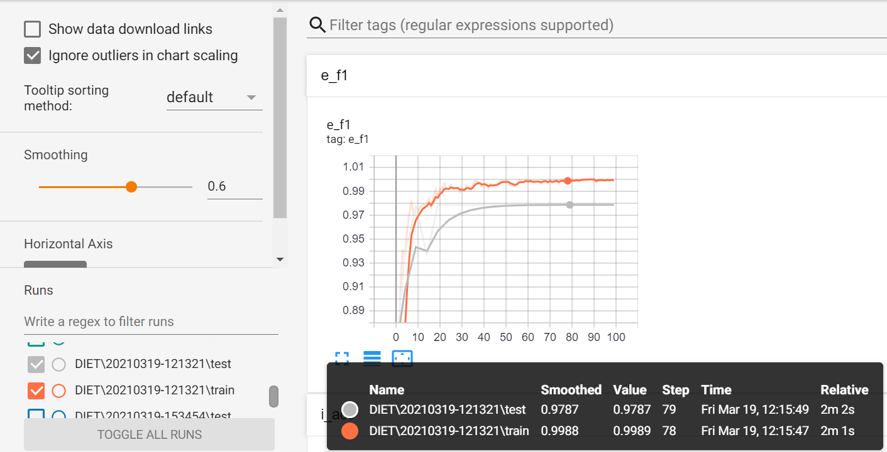
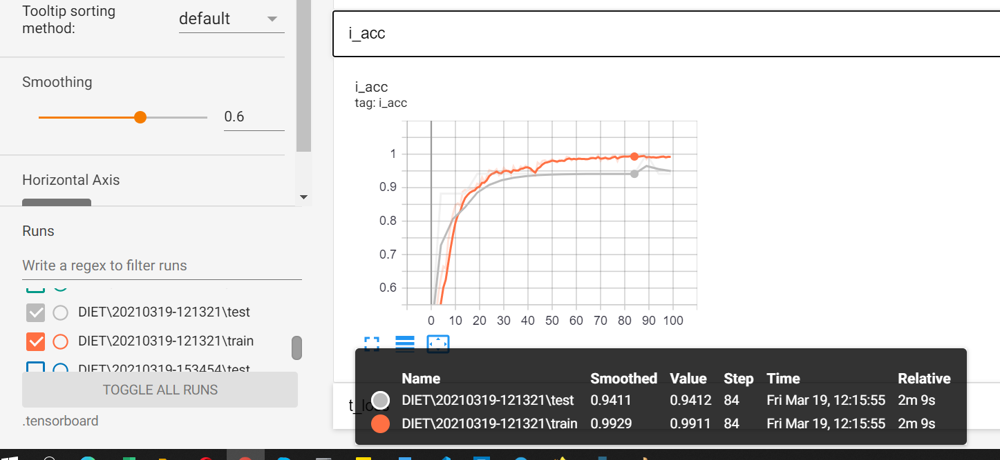
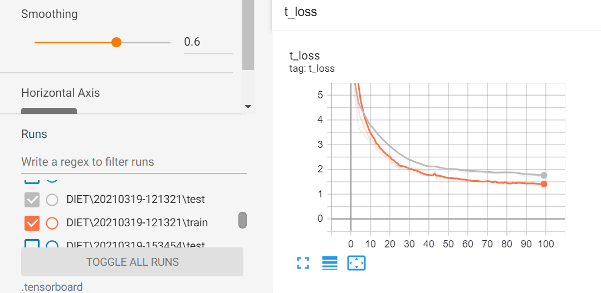
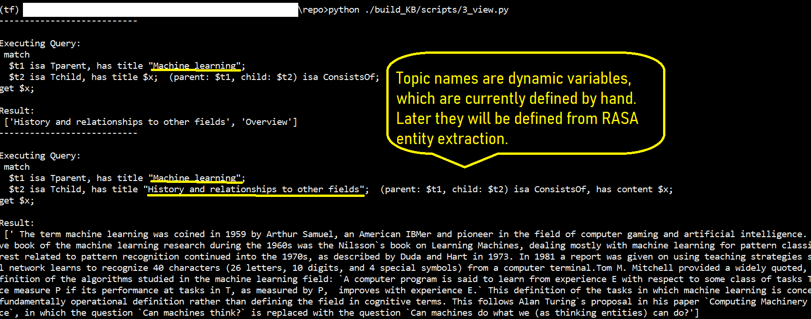

# Testing guidelines

## Standard Combined test NLU + Core - Most recommended

This covers both NLU and core testing. 

### Run the test

```ruby
 $ rasa test
```

### Interpreting test outputs

** Found in `results` folder**

#### Intent Classifiers

- The rasa test script will produce a report (intent_report.json), confusion matrix (intent_confusion_matrix.png) and confidence histogram (intent_histogram.png) for your intent classification model.

- The report logs precision, recall and f1-score for each intent, as well as providing an overall average. You can save these reports as JSON files using the --report argument.

- The confusion matrix shows which intents are mistaken for others. Any samples which have been incorrectly predicted are logged and saved to a file called errors.json for easier debugging.

- The histogram allows you to visualize the confidence for all predictions, with the correct and incorrect predictions being displayed by blue and red bars respectively. 

- In case the numbers are not workable, for achieving better results, most promising solution is to manually generate more training data.  

#### Entity Extraction

- rasa test reports recall, precision, and f1-score for each entity type that your trainable entity extractors are trained to recognize.

- Only trainable entity extractors, such as the DIETClassifier and CRFEntityExtractor are evaluated by rasa test.


## Tensorboard visualization test - To validate the training cycle accuracy 
1. Enable tensorboard logging in `config.yml`.

- Commented code is placed already (lines 13-17) in the pipeline. 

2. After uncommenting the code, ensure that log directory exists with correct name and in correct location. Currently the log directory is `.tensorboard` already present in same folder. 


#### To run the test- 
First train a new model with, 

```ruby
 $ rasa train
```

After the training is completed, 

```ruby
 $ tensorboard --logdir=YOUR_LOG_DIR --host=127.0.0.1
```

i.e. 

```ruby
 $ tensorboard --logdir=.tensorboard --host=127.0.0.1
```

#### Visualize the training and test results- 

- To access the tensorboard on http://127.0.0.1:6006/

#### Outputs 








## Supplementary tests 

### 1. Validating Data and Stories

Data validation verifies that no mistakes or major inconsistencies appear in the training data i.e. domain, NLU data, or story data. 

#### To run the test- 
```ruby
 $ rasa data validate
```

#### Test output

> 2021-03-19 12:57:14 INFO     rasa.validator  - Validating intents...
>
> 2021-03-19 12:57:14 INFO     rasa.validator  - Validating uniqueness of intents and stories...
>
> 2021-03-19 12:57:14 INFO     rasa.validator  - Validating utterances...
>
> 2021-03-19 12:57:14 INFO     rasa.validator  - Story structure validation...
>
> Processed story blocks: 100%|███████████████████████████████████████████| 14/14 [00:00<00:00, 875.00it/s, # trackers=1]
>
> 2021-03-19 12:57:14 INFO     rasa.core.training.story_conflict  - Considering all preceding turns for conflict analysis.2021-03-19 12:57:14 INFO     rasa.validator  - No story structure conflicts found.
>

#### For more options on this test 
[See this](https://rasa.com/docs/rasa/command-line-interface#rasa-data-validate)


### 2. Evaluating an NLU Model

In addition to testing stories, you can also test the natural language understanding (NLU) model separately. 

Once your assistant is deployed in the real world, it will be processing messages that it hasn't seen in the training data. 

To simulate this, you should always set aside some part of your data for testing. You can split your NLU data into train and test sets using:


#### To create the split- 
```ruby
 $ rasa data split nlu --training-fraction 0.8
```
#### For more options on split command 
[See this](https://rasa.com/docs/rasa/command-line-interface#rasa-data-split)

Next, you can see how well your trained NLU model predicts the data from the test set you generated, with following- 

#### Run the test 
```ruby
 $ rasa test nlu
```

#### Test output

> 2021-03-19 13:17:39 INFO     rasa.model  - Loading model models\> 20210221-194337.tar.gz...
>
> 2021-03-19 13:17:46 INFO     rasa.shared.utils.validation  - The 'version' key is missing in the training data file 
>
> 2021-03-19 13:17:46 INFO     rasa.nlu.test  - Running model for predictions:

>100%|███████████████████████████████████████████████████████████████████████████████████████████████████████████████████████████████████| 466/466 > [00:03<00:00, 121.86it/s]
>
> 2021-03-19 13:17:50 INFO     rasa.nlu.test  - Intent evaluation results:
>
> 2021-03-19 13:17:50 INFO     rasa.nlu.test  - Intent Evaluation: Only considering those 466 examples that have a defined intent out of 466 examples.
>
> 2021-03-19 13:17:50 INFO     rasa.nlu.test  - ** Classification report saved to results\intent_report.json **.
>
> 2021-03-19 13:17:50 INFO     rasa.nlu.test  - ** Incorrect intent predictions saved to results\intent_errors.json **.
>
> 2021-03-19 13:17:50 INFO     rasa.utils.plotting  - Confusion matrix, without normalization:
>
> [ [  2   0   0   0   0   0   0   0   0   0   0   0   0   0   0   0   0]
>
> [  0   7   0   0   0   0   0   0   0   0   0   0   0   0   0   0   0]
>
> [  0   0  17   0   0   0   0   0   0   0   0   0   0   0   0   0   0]
>
> [  0   0   0   5   0   0   0   0   0   0   0   0   0   0   0   0   0]
>
> [  0   0   0   0   4   0   0   0   0   0   0   0   0   0   0   0   0]
>
> [  0   0   0   0   0  79   0   0   0   0   0   0   0   0   0   0   0]
>
> [  0   0   0   0   0   0  22   0   0   1   0   0   0   0   0   0   0]
>
> [  0   0   0   0   0   0   0 180   0   0   0   0   0   0   0   0   0]
>
> [  0   0   1   0   0   0   0   0  40   0   0   0   0   0   0   0   0]
>
> [  0   0   0   0   0   0   0   0   0  13   0   0   0   0   0   0   0]
>
> [  0   0   0   0   0   0   0   0   0   0   9   0   0   0   0   0   0]
> 
> [  0   0   0   0   0   3   0   0   0   0   0  51   0   0   0   0   0]
>
> [  0   0   0   0   0   0   0   0   0   0   0   0   5   0   0   0   0]
>
> [  0   0   0   0   0   0   0   0   0   0   0   0   0  19   0   0   0]
>
> [  0   0   0   0   0   0   0   0   0   0   0   0   0   0   2   0   0]
>
> [  0   0   0   0   0   0   0   0   0   0   0   0   0   0   0   3   0]
>
> [  0   0   0   0   0   0   0   0   0   0   0   0   0   0   0   0   3]]

> 2021-03-19 13:17:52 INFO     rasa.nlu.test  - Entity evaluation results:
>
> 2021-03-19 13:17:52 INFO     rasa.nlu.test  - Evaluation for entity extractor: DIETClassifier
>
> 2021-03-19 13:17:52 INFO     rasa.nlu.test  - Classification report saved to results\DIETClassifier_report.json.
>
> 2021-03-19 13:17:52 INFO     rasa.nlu.test  - Every entity was predicted correctly by the model.
>
> 2021-03-19 13:17:53 INFO     rasa.utils.plotting  - Confusion matrix, without normalization:
>
> [ [ 348    0    0    0]
>
> [   0  266    0    0]
>
> [   0    0   56    0]
>
> [   0    0    0 1529]]

### 3. Full NLU evaluation with cross validation

** Extensive cross validation ** with multiple permutation combinations of train - CV and configuration combinations. 

It creates multiple models with different splits and configuration settings. In present example, A dummy config file (config1.yml) is created to make a comparision along with our current configuration (config.yml). 

- The `results` folder would contain 3 `run` folders. 

- Each `run` contains split scenarios in step of 25%. 

#### Run the test 
```ruby
 $ rasa test nlu --nlu data/nlu.yml --config config.yml config1.yml
```

Similar tests can also be conducted on RASA core if required. [See](https://rasa.com/docs/rasa/testing-your-assistant/#comparing-policy-configurations) 

 
# Latest update [:hatching_chick: > :hatched_chick:]

The new agent can handle larger variety of scenarios*

1. More elegent step wise explanation of chosen topic
2. Multi-turn conversation prompts 
3. Offer variety of options based on user's choices ( wiki / medium)
4. Longer engagement of user with multiple switch possibilities
5. Prompt sibling nodes / reserch articles on the topic 
6. The agent learns from scenarios it handles and forms its search queries dynamically
7. Graceful fallbacks to minimize crashes in unforeseen scenarios


*Tested scenarios can be found under folder v1.1_conversations_21022020. 

Note that there is large variety of permutation / combinations that the assistant has learnt from. Hence more testing is encouraged. 

# Next improvements plan [:baby_chick:]

# :construction:

1. Build article ranking mechanism. The score can be based on

- last articles seen by the user

- from same author 

- on similar subject lines

- depending on popularity (claps / comments)

- deeper corelation with the topic chain followed by the user


2. Build subtopic recommendation mechanism. The score can be based on

- topic chain followed by the user

- articles read by the user 

- analysing user's feedback in ongoing conversation (responses to turns taken)

3. Enable deeper level network navigation

- currently bot is able to go till 2 levels while exploring a topic, Going till leaf need would require adding more complex recursive scenarios 

4. Making the bot more friendly

- compile a small-talk DB (from public dataset)

- arrange in the rasa training format and train the bot on it

- essential to ensure graceful handling of unseen scenarios 

5. Rearrange the folder structure for centralized control ( done partially)

6. Add more and more synonyms / acronyms to help the assistant point to relevent sources. 

7. Test current version and, 

- identify the scenarios where the assistant struggles 

- improve those conversation paths with tuning / story realignment / training / custom actions

- add new more complex conversation paths (e.g. multi-entity intents)


# :construction:


# Folder structure


# Configurations

At the root level, the *config.ini* is defined. 

This file contains the folder structure and data storage paths. 

With this, all scripts can be run at the root level. 

# Wiki Scrapping and graph tree structure construction :heavy_check_mark:

## Data dictionary (output JSON):   

1. `URL` : URL of the article
1. `tag` : the topic of article
1. `sections` : levelled list of sections
1. `full_text` : entire text body


## Steps 
- :file_folder:build_wiki_data ( or as set in config)
### 1. Scrapping the topics :heavy_check_mark:

#### Objective: 

To scrap data from wikipedia based on list of topics or csv (to be uncommented).

#### Run from the root
```ruby
 $ python ./build_wiki_data/scripts/1_scrape.py
```
or
```ruby
 $ python ROOT_DIR/WIKI_DIR/SCRIPTS_DIR/filename.py
```

### 2. Parse the data :heavy_check_mark:

#### Objective: 

To parse and clean the scrapped wikipedia content.

#### Run from the root
```ruby
$ python ./build_wiki_data/scripts/2_parse.py
```
or
```ruby
$ python ROOT_DIR/WIKI_DIR/SCRIPTS_DIR/filename.py
```
### 3. Structure the data into tree :heavy_check_mark:

#### Objective: 

To construct structured tree from wiki topics and content.

#### Run from the root
```ruby
$ python ./build_wiki_data/scripts/3_structure.py
```
or
```ruby
$ python ROOT_DIR/WIKI_DIR/SCRIPTS_DIR/filename.py
```


# Grakn Knowledge base design :heavy_check_mark:

## Steps
- :file_folder:grakn

### 1. Download and install Grakn console and Grakn workbase :heavy_check_mark:

*(The entire setup for windows is ready within the folder so no extra installation should be required)*

#### 2. Initiate the Grakn console and define a keyspace with schema file. :heavy_check_mark:

#### Objective: 

To define schema for the keyspace impulso [finalized as on 08 Dec 2020.]

#### Run script 

:point_right: Inside Grakn folder ( ensuring access grakn server and console)

```ruby
$ [RELATIVE PATH OF GRAKN SERVER BASH e.g. .\] grakn server start 
```
and then run the schema file, 
```ruby
[RELATIVE PATH OF GRAKN CONSOLE BASH e.g. .\]grakn console --keyspace [KEYSPACE NAME] --file [RELATIVE PATH TO SCHEMA]
```
e.g.
```ruby 
$ .\grakn console --keyspace impulso0 --file ../../build_KB/scripts/1_schema.gql
```

#### Current Schema : :heavy_check_mark:


##### Entities : 

- `Tparent` : topic that acts as parent 
- `Tchild` : topic that acts as child
- `article` : article that acts as suppliment to a topic

##### Relations : 
- `ConsistsOf` : Relates Tparent and Tchild. e.g. Tparent ConsistsOf Tchild entity. 
- `ExplainedIn` : Relates a topic and article, e.g. Tchild ExplainedIn article entity. 

##### Attributes :
- Tparent `(title,URL,path_depth)`
- Tchild `(title,URL)`
- article `(UUID, URL, author, title)`
- ConsistsOf `(content)`
- ExplainedIn `(content)`

`path_depth` is added for fast reach of a node within the graph. Queries are optimized with this attribute. 

In Grakn all of the above are collectivly referred to as *concepts*. Hence it is also called a concept graph. 

### 3. Ingest wikipedia data.

#### Objective: 

- Collect wikidata and ingest in grakn schema. 

- This file traverses the datastore folders, creates the tree structure org, ingests and organizes the data inside this structure. 

- Custom functions required are scripted under grakn_utils.py.

#### Ingestion

Updated: Refer to [combined data ingestion in following sections](#wikimedium-data-ingestion) 

<!-- 
#### Run from the root
```ruby
$ python ./build_KB/scripts/2_data_ingestion.py
```
or
```ruby
$ python ROOT_DIR/WIKI_DIR/SCRIPTS_DIR/filename.py
```
#### Input  : 
For each topic, there should be a file created in parsed_data and structured_data folders. 


### 4. View data. :heavy_check_mark:


#### Objective: 

Check the data ingestion by testing view queries. 

#### Run from the root
```ruby
$ python ./build_KB/scripts/3_view.py
```
or 
```ruby
$ python ROOT_DIR/WIKI_DIR/SCRIPTS_DIR/filename.py
```
 -->


# RASA Assistant :heavy_check_mark:

## Steps

- :file_folder:impulso

### 1. Make sure grakn database (with selected topics) and rasa are up and working. 


### 2. start grakn server ( refer command above)

### 3. start rasa actions server within the folder


```ruby
$ rasa run actions
```

### 4. start rasa bot with existing model 


```ruby
$ rasa shell

```

### 5. Alternatively, you can also train the model. 

#### 5.1: Generate training data
- :file_folder:RASA_train_NLU

##### Question patterns: 

Defined in datastore > question_templates_topic_defination.csv

##### Topic names - Tchild and Tparents 

To be sourced autmatically from structured data path i.e. tree structure CSVs - constructed in earlier steps. 

##### Generate questions: 

```ruby
$ python ./RASA_train_NLU/scripts/1_generate_Tchild_questions.py
$ python ./RASA_train_NLU/scripts/1_generate_Tparent_questions.py

```

Output will be stored in datastore. e.g. 

> TchildQs.txt
> TparentQs.txt


#### 5.2: Set training data
- :file_folder:impulso

These texts are then to be placed in impulso > data > nlu.yml 

##### Formatting and placement instructions 

1. Questions in TchildQs or TparentQs must be reformatted. In RASA nlu.yml, multiple utterance examples are present as reference.  
2. Tparent questions are to be placed under the intent ``know_about`` and Tchild questions are to be placed as training examples of ``next_level`` intent. 

#### 5.3: Train model
- :file_folder:impulso

```ruby
$ rasa train

```
### 6. Validation results  

Evaluation matrices can be found under *results* folder inside. 

This makes sure all the intents and entities are correctly registered and that there are no conflicting stories. 

Refer to core and nlu log files for summary reports. 


### Possible Conversation paths :rocket:

Major upgrade with intertwined conversation paths 


- Old conversations can be reviewed under folder v1.0

- New conversations are under folder v1.1.


# Wiki pipeline optimization : :heavy_check_mark:

## Main objectives: 

1/ Improve entity and intent classification = better response generation for variety of coversation paths

2/ Optimize response time i.e. minimize the time of fetching / searching data from grakn graph
 

# Wiki+Medium data Ingestion 


#### Objective: 


- This is a new ingestion module that is able to ingest *BOTH* medium and wiki data.  

- Custom functions required are scripted under grakn_utils.py with special processing for medium data. 

- For testing the ingestion testing the parsed files for 5 topics are placed under build_medium_data/datastoreparsed_data.

- To test,


#### Run from the root
```ruby
$ python ./build_KB/scripts/2_data_ingestion2x.py
```
or
```ruby
$ python ROOT_DIR/WIKI_DIR/SCRIPTS_DIR/filename.py
```
#### Input  : 
- For testing the ingestion testing the parsed files for 5 topics are already placed under build_medium_data/datastore/parsed_data.

*Important points*

- Due to high number of articles, the ingestion module may be slow to run. For testing purpose the no. of articles limit is set to 5. 

[EDIT] new limit is 50. The value for this can be directly set by variable called `n_articles` in the script.

- In the script, instructions are provided to uncomment, if you wish to run for all articles.

- Another factor to be understood is there must be a small delay while inserting data in grakn ( have organized with sleep of 0.1 sec). 

- Immidiate insertions of large scale data risks crashing grakn server.

- :flashlight: Please ensure constructing new schema with new database name `impulso0`. Instructions are mentioned above.

# Medium data collection and organization 

## Data dictionary (output columns):

1. UUID : Universally unique identifier created for each article URL	
1. url : Article URL	
1. topic : Main topic or key word e.g. Data science / Artificial intelligence / ..	
1. title : Title of the article	
1. subtitle	: If available, subtitle for further emphasis on the article's theme
1. tags	: associated tags which are covered in the article
1. tag_links : links underlying the tags  
1. author	: list of writers
1. h1_headers : List of first level headings	
1. h2_headers	: List of second level headings
1. paragraphs : List of paragraphs (each paragraph is a separate entity of 2-5 sentences generally)	
1. blockquotes	: Quotes used by the writers
1. bold_text	: List of important sentances 
1. italic_text : List of codes or special terms as highlighted by writers
1. figures : List of 'full-size' image URLs   
1. links : List of internal reference links in the article  
1. external_links : List of links that point outside medium or its partner websites   


## Steps


### 1. Collect URLS from medium
- :file_folder:medium-url-scraper
- Script to run: scrape_master.py
- Settings in script: You can change the tag and timeline.

### 2. Remove redundent URLs and further cleaning: 
Same URL could be found multiple times, under multiple different tags. 
There are two sub folders for 2009-16 and 2016-20.
- :file_folder:Medium_scrape_URL_cleaning_EDA
- Scripts to run: Go in the corresponding folder and you will see a jupyter notebook (e.g. data_cleaning_2016-2020.ipynb)
- Raw data : in folder scraped_tags
- Final output: Single CSV for that time period (e.g. Medium_scrape_urls_multi-tag _clean_2016-2020.csv)

### 3. Scrap body and image URLS 
- :file_folder:Medium_scrape_text_and_image
- Script to run : article_text_img_scraping.py
- Input data: Please place cleaned csv- as generated on 2nd step. (e.g. Medium_scrape_urls_multi-tag _clean_2016-2020.csv)
- Output data: contents_op_*.csv

New copy of sample articles are scrapped. 

Please refer : contents_op_Medium_scrape_urls_multi-tag _clean_2016-2020.csv [csv](https://github.com/ahm10/impulso/blob/master/Medium_scrape_text_and_image/2016-2020/contents_op_Medium_scrape_urls_multi-tag%20_clean_2016-2020.csv)


*P.S.*
:memo:


-requirements.txt is available for the environment setup. Please ensure  correct version of chrome driver in respective folders.


-You can also refer instance setup file - example in Medium_scrape_text_and_image folder.


## Medium - preprocess

### Extract unique tags - steps 

- :file_folder:Medium_data_preprocess
- Script to run: unique_tags.py
- Settings in script: The script reads content files from the adjacent "data" folder. So please make sure all content files you want to process are placed in there. 
- Output data: All unique tags with their total occurances have been logged into a CSV file in "op" folder.

### Article content preprocessing 
This includes- 
1. Cleaning,

2. Organizing 

3. Breaking it down into sentences. 

- :file_folder:Medium_data_preprocess
- Script to run: parse_articles.py
- Settings in script: The script reads content files from the adjacent "data" folder. So please make sure all content files you want to process are placed in there. 
- Output data: All articles with thier UUID and sentences (in list form) have been logged into a CSV file in "op" folder in file name parsed_*...csv


*P.S.* For environment setup, use the requirements.txt available in given folder.


 