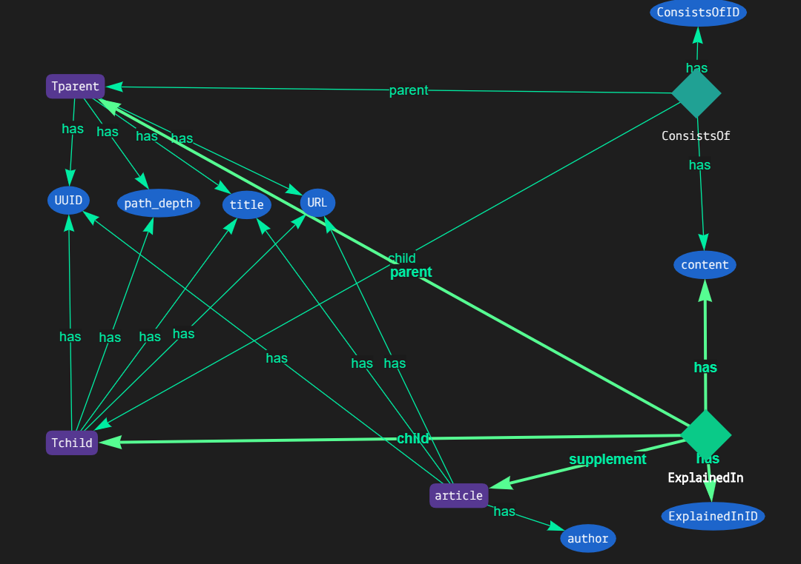

# Folder structure

# Configurations

At the root level, the *config.ini* is defined. This file contains the folder structure and data storage paths. 

With this, all scripts can be run at the root level. 

# Wiki Scrapping and graph tree structure construction

## Data dictionary (output JSON):   

1. URL : URL of the article
1. tag : the topic of article
1. sections : levelled list of sections
1. full_text : entire text body

## Steps 
- :file_folder:build_wiki_data ( or as set in config)
### 1. Scrapping the topics :heavy_check_mark:

#### Objective: 

To scrap data from wikipedia based on list of topics or csv (to be uncommented).

#### Run from the root

>> python ./build_wiki_data/scripts/1_scrape.py

or

>> python ROOT_DIR/WIKI_DIR/SCRIPTS_DIR/filename.py

### 2. Parse the data :heavy_check_mark:

#### Objective: 

To parse and clean the scrapped wikipedia content.

#### Run from the root

>> python ./build_wiki_data/scripts/1_parse.py

or

>> python ROOT_DIR/WIKI_DIR/SCRIPTS_DIR/filename.py

### 3. Structure the data into tree :heavy_check_mark:

#### Objective: 

To construct structured tree from wiki topics and content.

#### Run from the root

>> python ./build_wiki_data/scripts/3_structure.py

or

>> python ROOT_DIR/WIKI_DIR/SCRIPTS_DIR/filename.py

# Grakn Knowledge base design :heavy_check_mark:

## Steps
- :file_folder:grakn

### 1. Download and install Grakn console and Grakn workbase 

*(The entire setup for windows is ready within the folder so no extra installation should be required)*

#### 2. Initiate the Grakn console and define a keyspace with schema file.

#### Objective: 

To define schema for the keyspace impulso [finalized as on 08 Dec 2020.]

#### Run script 

:push_pin: Inside Grakn folder ( ensuring access grakn server and console)
 
>> [RELATIVE PATH OF GRAKN SERVER BASH e.g. .\]grakn server start 

and then run the schema file, 

>> [RELATIVE PATH OF GRAKN CONSOLE BASH e.g. .\]grakn console --keyspace [KEYSPACE NAME] --file [RELATIVE PATH TO SCHEMA]

e.g. 
>> .\grakn console --keyspace impulso2 --file ../../build_KB/scripts/1_schema.gql

#### Current Schema : :heavy_check_mark:

##### Entities : 

- Tparent : topic that acts as parent 
- Tchild : topic that acts as child
- article : article that acts as suppliment to a topic

##### Relations : 
- ConsistsOf : Relates Tparent and Tchild. e.g. Tparent ConsistsOf Tchild entity. 
- ExplainedIn : Relates a topic and article, e.g. Tchild ExplainedIn article entity. 

##### Attributes :
- Tparent (title,URL)
- Tchild (title,URL)
- article (UUID, URL, author, title)
- ConsistsOf(content)
- ExplainedIn (content)

In Grakn all of the above are collectivly referred to as *concepts*. Hence it is also called a concept graph. 

### 3. Ingest the data. :heavy_check_mark:

#### Objective: 

- Collect wikidata and ingest in grakn schema. 

- This file traverses the datastore folders, creates the tree structure org, ingests and organizes the data inside this structure. 

- Custom functions required are scripted under grakn_utils.py.

#### Run from the root

>> python ./build_KB/scripts/2_data_ingestion.py

or

>> python ROOT_DIR/WIKI_DIR/SCRIPTS_DIR/filename.py

#### Input  : 
For each topic, there should be a file created in parsed_data and structured_data folders. 

### 4. View data. :heavy_check_mark:

#### Objective: 

Check the data ingestion by testing view queries. 

#### Run from the root

>> python ./build_KB/scripts/3_view.py

or 

>> python ROOT_DIR/WIKI_DIR/SCRIPTS_DIR/filename.py

# Medium_Scraper  

## Data dictionary (output columns):

1. UUID : Universally unique identifier created for each article URL	
1. url : Article URL	
1. topic : Main topic or key word e.g. Data science / Artificial intelligence / ..	
1. title : Title of the article	
1. subtitle	: If available, subtitle for further emphasis on the article's theme
1. tags	: associated tags which are covered in the article
1. tag_links : links underlying the tags  
1. author	: list of writers
1. h1_headers : List of first level headings	
1. h2_headers	: List of second level headings
1. paragraphs : List of paragraphs (each paragraph is a separate entity of 2-5 sentences generally)	
1. blockquotes	: Quotes used by the writers
1. bold_text	: List of important sentances 
1. italic_text : List of codes or special terms as highlighted by writers
1. figures : List of 'full-size' image URLs   
1. links : List of internal reference links in the article  
1. external_links : List of links that point outside medium or its partner websites   

## Steps

### 1. Collect URLS from medium
- :file_folder:medium-url-scraper
- Script to run: scrape_master.py
- Settings in script: You can change the tag and timeline.

### 2. Remove redundent URLs and further cleaning: 
Same URL could be found multiple times, under multiple different tags. 
There are two sub folders for 2009-16 and 2016-20.
- :file_folder:Medium_scrape_URL_cleaning_EDA
- Scripts to run: Go in the corresponding folder and you will see a jupyter notebook (e.g. data_cleaning_2016-2020.ipynb)
- Raw data : in folder scraped_tags
- Final output: Single CSV for that time period (e.g. Medium_scrape_urls_multi-tag _clean_2016-2020.csv)

### 3. Scrap body and image URLS 
- :file_folder:Medium_scrape_text_and_image
- Script to run : article_text_img_scraping.py
- Input data: Please place cleaned csv- as generated on 2nd step. (e.g. Medium_scrape_urls_multi-tag _clean_2016-2020.csv)
- Output data: contents_op_*.csv

New copy of sample articles are scrapped. 

Please refer : contents_op_Medium_scrape_urls_multi-tag _clean_2016-2020.csv [csv](https://github.com/ahm10/impulso/blob/master/Medium_scrape_text_and_image/2016-2020/contents_op_Medium_scrape_urls_multi-tag%20_clean_2016-2020.csv)

*P.S.*
:memo:

-requirements.txt is available for the environment setup. Please ensure  correct version of chrome driver in respective folders.

-You can also refer instance setup file - example in Medium_scrape_text_and_image folder.

# Neo4j-wiki

1. Neo4j sandbox is implemented.

2. Exported graph and JSON are available for review.

3. It is command line interface like SQL. So do not have instructions listed at the moment.

# Medium - preprocess

## Extract unique tags - steps 

- :file_folder:Medium_data_preprocess
- Script to run: unique_tags.py
- Settings in script: The script reads content files from the adjacent "data" folder. So please make sure all content files you want to process are placed in there. 
- Output data: All unique tags with their total occurances have been logged into a CSV file in "op" folder.

## Article content preprocessing :heavy_check_mark:
This includes- 
1. Cleaning,

2. Organizing 

3. Breaking it down into sentences. 

- :file_folder:Medium_data_preprocess
- Script to run: parse_articles.py
- Settings in script: The script reads content files from the adjacent "data" folder. So please make sure all content files you want to process are placed in there. 
- Output data: All articles with thier UUID and sentences (in list form) have been logged into a CSV file in "op" folder in file name parsed_*...csv

*P.S.* For environment setup, use the requirements.txt available in given folder.

:high_brightness:  Special instructions (if required) for spacy installment also attached in txt file besides requirements.txt

 